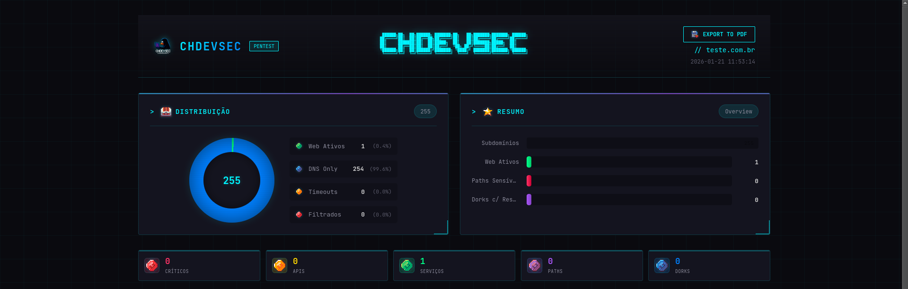
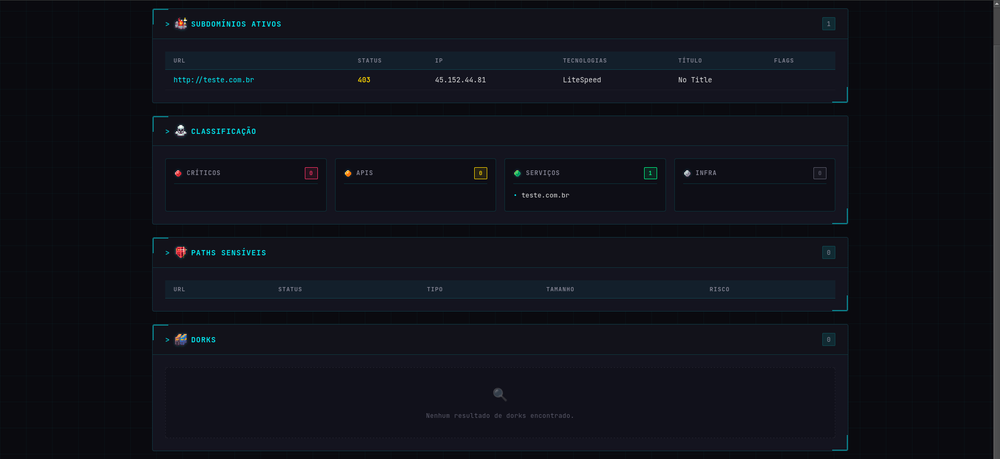
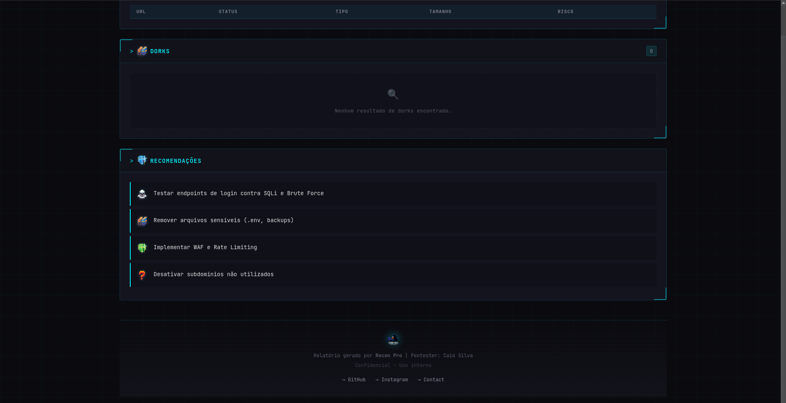

#  RECON PRO - Ultimate Web Reconnaissance

<div align="center">
  <!-- PLACEHOLDER FOR TOOL GIF -->
  <br>
  
  <br>
  <em>(Replace this line with your tool demonstration GIF)</em>
  <br><br>
</div>

<div align="center">

   **Active Development** &nbsp;&nbsp;
   **Python 3.x** &nbsp;&nbsp;
   **Linux/Kali** &nbsp;&nbsp;
   **MIT License**

</div>

---

##  Overview

**Recon Pro** is an advanced automated reconnaissance framework designed for **Bug Bounty Hunters** and **Pentesters**. It combines multiple open-source intelligence (OSINT) tools with custom Python scripting to deliver a comprehensive security analysis of target domains.

>  **Why Recon Pro?**  
> Unlike simple wrapper scripts, Recon Pro performs **intelligent technology detection**, **context-aware fuzzing**, and **smart vulnerability checks** (XSS, SQLi, Sensitive Files) tailored to the target's stack (Node.js, PHP, Python, etc.).

---

##  Key Features

###  1. Automated Subdomain Discovery
*   **Multi-Source Intelligence**: Integrates powerful tools like `Subfinder`, `Assetfinder`, `Amass`, and `Findomain`.
*   **API Leverage**: Uses **Shodan**, **SecurityTrails**, and **crt.sh** for maximum coverage.
*   **Smart Fallback**: Automatically switches to brute-force DNS if passive sources yield low results.
*   **Live Classification**: Automatically categorizes subdomains into:
    *    **Web Active** (HTTP/HTTPS)
    *    **DNS Only**
    *    **Filtered/Timeouts**

###  2. Intelligent Fuzzing & Exploitation
*   **Tech-Aware Payloads**: Detects technologies (e.g., Laravel, React, Wordpress) and adjusts payloads accordingly.
*   **Vulnerability Scanner**: Checks for:
    *   Reflected XSS (Context-aware)
    *   SQL Injection (Error-based)
    *   Sensitive Files (`.env`, `.git`, backups)
    *   Admin Panels & Login Interfaces
*   **Google Dorking**: Automates search queries to find sensitive exposed data.

###  3. Professional Reporting
*   Generates a **beautiful HTML Dashboard** for analyzing results.
*   **Interactive Summary**: view live hosts, technologies, and critical findings in a clean interface.
*   **Auto-Open**: Option to automatically open the report upon completion.

---

##  Gallery

<div align="center">
  
  <!-- Dashboard Main View -->
  
  <br><br>

  <!-- Scan Details -->
  
  <br><br>

  <!-- Vulnerability Report -->
  
  
  <br><br>
  <em> Recon Pro HTML Dashboard Preview</em>

</div>

<br>

<div align="center">
  <!-- Placeholder for CLI if needed later -->
  
  <br>
  <em> CLI Output (Run the tool to see it live!)</em>
</div>

---

##  Installation

We provide a **robust installer** (`install.sh`) that sets up your environment automatically.

### Prerequisites
*   **OS**: Linux (Kali, Ubuntu, or Debian)
*   **Python**: 3.7+
*   **Sudo Access**: Required for system packages.

###  Quick Start

```bash
# 1. Clone the repository
git clone https://github.com/chdevsec/recon_pro.git
cd recon_pro

# 2. Give execution permissions
chmod +x install.sh

# 3. Run the installer
./install.sh
```

---

##  Usage

### Basic Scan
Simply run the python script with your target domain.

```bash
python3 recon.py target.com
```

### Interactive Mode
The tool will prompt you to select the target technology for specialized attacks:

```text
[+] Select target technology for specific tests:
  1. PHP
  2. Node.js
  3. Next.js
  4. Angular
  ...
```

---

##  Configuration

To enable **API-based** recon (Shodan, SecurityTrails, etc.), edit the `recon.py` file and add your keys:

```python
# API Configuration in recon.py
API_KEYS = {
    "SECURITYTRAILS": "YOUR_KEY_HERE", 
    "SHODAN": "YOUR_KEY_HERE", 
    "GOOGLE_API_KEY": "YOUR_KEY_HERE", 
    "GOOGLE_CSE_ID": "YOUR_CX_ID_HERE" 
}
```

---

##  Legal Disclaimer

**Recon Pro** is intended for **educational and authorized security testing purposes only**.

*    **Do not** use this tool against systems you do not have explicit permission to test.
*   The developers (**CHDEVSEC**) assume no liability and are not responsible for any misuse or damage caused by this program.
*   Always follow responsible disclosure policies.

---

<div align="center">

  ###  Developed by [CHDEVSEC](https://github.com/chdevsec) | Pentester Caio

   **Happy Hacking!** 

</div>
